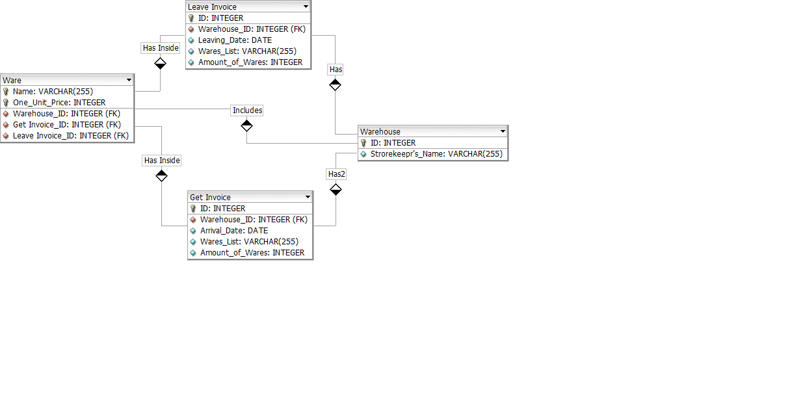

# Лабораторная 1 по дисциплине "Базы данных"

Тема: Разработка концептуальной модели базы данных на основе метода «Объект-Связь»

Выполнил: Студент Группы 02261-ДБ Ковалев Егор Юрьевич

**Вариант 7**: Учет наличия товара на складе

Имеются товары (наименование, цена единицы) и склады (номер, ФИО кладовщика). На склад поступает приходные накладные. Товары, приходящие на склад, сопровождаются накладной с заданным номером, где указывается дата поступления, список наименований поступивших товаров и их количество. При отгрузке товара со склада формируется документ об отгрузке, где указываются: номер документа, дата отгрузки, список наименований товаров и их количество.

Выходные документы:

- [ ] для каждого склада выдать список товаров, с указанием их количества, поступившего на этот склад до заданной даты, отсортированный по наименованию товаров, с указанием цены каждого товара;

- [ ] выдать список товаров, отгруженных в заданный интервал дат, отсортированный по дате отгрузки, а затем по наименованию товара.

## Структура докуманта "Накладная"

## Концепция формализации постановки задачи

Итак, у нас есть **склад**, который **включает товары**. В задаче говорится только об одном складе и множестве товаров, поэтому, отношение будет **1:N**. Склад может пустовать без товаров, но так же может иметь любое их разумное количество, однако, товарам негде храниться, если нет склада, поэтому, для них он обязателен, следовательно, класс принадлежности этой связи **О-Н**. 
	
**Товары перечислены** в списке **накладной**. В накладной указано конечное количество товаров, поэтому отношение  **1:N**. В накладной нет смыла, если в ней не указано ни одного товара, поэтому, товары обязательны, так же и накладная, без которой не могут совершаться операции над товарами, следовательно, она тоже обязательна, тогда класс принадлежности ~~**Н-Н**~~ **О-О**.
	
**Склад** может **принимать** множество **накладных**, в то время как каждая накладная относится только к одному складу, тогда связь **1:N**. Для склада накладная не обязательна, он может быть просто складом, но для накладной склад обязателен, иначе в ней нет смысла, отсюда связь **О-Н**.
	
Теперь о ключевых атрибутах. **Товары** (наименование и цена единицы) могут, безусловно, отличаться по наименованию, однако, возможно, что наименование одно, но цена различна, тогда **оба атрибута ключевые**.

**Склад** (номер, ФИО кладовщика) может иметь нескольких кладовщиков, либо они могут меняться, поэтому **ключевой атрибут – номер склада**. 

**Накладная** (номер, дата отгрузки, список товаров, количество товаров) думаю, что **ключевой атрибут** здесь только **номер накладной**, так как все остальные – optional и могут меняться в зависимости от обстоятельств, а номер статичен.

## ER–диаграмма

## Построение отношений с использованием правил

**Товар**  (*наименование*, *цена единицы*)

**Склад**  (*номер*, ФИО кладовщика)

**Накладная** (*номер*, дата отгрузки, список товаров, количество товаров)

